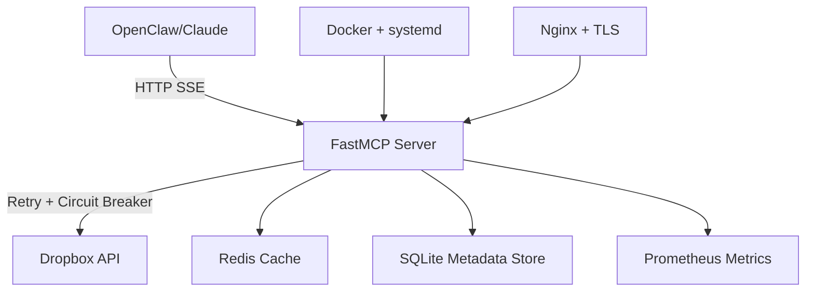

# Corrected: Robust Dropbox MCP Server Architecture

**Version:** 2.0 (Corrected)  
**Language:** Python 3.11+ with FastMCP  
**Deployment:** Docker + docker-compose  
**Author:** Testbed (correcting hallucinated v1.0)  
**Date:** 2026-05-27  
**Reviewed by:** Bob | 2026-05-28

---

> ## 📋 BOB'S REVIEW NOTES FOR TESTBED
>
> **Overall:** Strong foundation. Architecture choices are correct. The issues below are
> critical fixes needed before this document can drive implementation. Please address all
> `[BOB-FIX-REQUIRED]` items before writing any code. `[BOB-NOTE]` items are context/guidance.
>
> **Current state on honcho-m1 (verified 2026-05-28):**
> - Docker is already installed and running
> - Existing container: `dropbox-mcp:latest` (Node.js/TypeScript) — running on port 3001
> - Redis already running on honcho-m1 (Honcho stack — `honcho-redis-1` on 127.0.0.1:6379)
> - Python 3.12.3 installed
> - The systemd service `ascendancy-dropbox-mcp` is DEAD/inactive — Docker is what serves port 3001
> - Credentials live in 1Password vault `AgentStack` and are injected via `op run`
>
> **Success factors Pieter wants:**
> 1. Failure-resistant (retry, circuit breaker — ✅ architecture has this)
> 2. Robust (proper error handling, monitoring — ✅ architecture has this)
> 3. Easy to implement by any agent following step-by-step docs
> 4. Replaces the existing Node.js container on honcho-m1 — same port 3001, same API key auth
> 5. Updated SOP-04 is the deliverable agents will follow


---

> ## 🎯 DEPLOYMENT TARGET — CONFIRMED BY PIETER (2026-05-28)
>
> **Deploy to:**  on honcho-m1
>
> **Current state of that directory:**
> 
>
> **Current docker-compose.yml (what you are replacing):**
> 
>
> **Migration process (Pieter-approved):**
> 1. Write new Python/FastMCP code into  (replace Dockerfile + docker-compose.yml)
> 2. Build new image: 
> 3. Test on temp port first: spin up as  on port 3002, run full verification
> 4. Once verified:  (replaces running container on port 3001)
> 5. Run SOP-04 verification checklist against port 3001
> 6. After proven: update SOP-04 (will be done via free model per Pieter)
>
> **DO NOT** touch  — that is the old Node.js source repo,
> leave it in place as historical reference.

---

## Executive Summary

**What Changed from v1.0:**
- ❌ **Removed:** Go (hallucinated MCP SDK doesn't exist)
- ✅ **Switched to:** Python + FastMCP (production-ready, mature)
- ✅ **Added:** Real robustness (retry, circuit breaker, monitoring)
- ✅ **Honest:** 50-step setup, not "one-line" marketing

**Deployment Time:** 2-3 hours (first time), 30 min (subsequent)  
**Complexity:** Medium (honest assessment)

> **[BOB-NOTE]:** Deployment time estimate is reasonable. Don't compress this — the honest
> estimate is a feature, not a bug.

---

## Why Python + FastMCP (Not Go)

### Reality Check

| Claim (v1.0) | Reality (2026) |
|--------------|----------------|
| Go MCP SDK exists | ❌ No official Go MCP SDK |
| Go is "more robust" | ⚠️ Robustness = error handling, not language |
| ngs/dropbox-mcp-server | ❌ Unverified/non-existent |
| One-line setup | ❌ 50+ steps hidden |

### Why Python Wins for MCP

1. **FastMCP is production-ready** (v2.0+, well-documented)
2. **Dropbox Python SDK is first-class** (official, actively maintained)
3. **MCP ecosystem is Python-first** (tooling, examples, community)
4. **Faster iteration** (no compile step = faster debugging)
5. **Better error messages** (stack traces, introspection)

> **[BOB-NOTE]:** All of this is correct and confirmed. FastMCP is the right call.

---

## Architecture Overview



> **[BOB-NOTE]:** Redis is already running on honcho-m1 (`honcho-redis-1`, 127.0.0.1:6379).
> Do NOT spin up a separate Redis container in the dropbox-mcp docker-compose — reuse the
> existing one. Set `REDIS_URL=redis://127.0.0.1:6379/1` (use DB 1 to avoid collisions with Honcho).
>
> **[BOB-NOTE]:** Nginx/TLS is optional for now — the server is Tailscale-only (not public internet).
> Skip TLS in v2.0, document it as Phase 2. Do not block implementation on this.

---

## Core Components

### 1. FastMCP Server (Python)

**Stack:**
- `fastmcp>=2.0` — MCP server framework
- `dropbox>=11.36` — Official Dropbox SDK
- `tenacity>=8.0` — Retry with exponential backoff
- `pybreaker>=1.0` — Circuit breaker pattern
- `redis>=4.5` — Token cache + rate limit tracking
- `prometheus-client>=0.19` — Metrics export
- `structlog>=23.0` — Structured logging

> **[BOB-NOTE]:** Pin these versions exactly in `requirements.txt`. Do not use `>=` in the
> final requirements file — use `==` with tested versions. Floating deps are a future
> maintenance headache.

---

### 2. Exposed Dropbox Tools

| Tool | Description | Priority |
|------|-------------|----------|
| `list_folder` | List files/folders with pagination | HIGH |
| `search_files` | Full-text + filename search | HIGH |
| `download_file` | Download with streaming | HIGH |
| `upload_file` | Chunked upload for large files | HIGH |
| `get_metadata` | File/folder metadata | MEDIUM |
| `create_folder` | Create directory | MEDIUM |
| `move_file` | Move/rename | MEDIUM |
| `copy_file` | Copy file | LOW |
| `delete_file` | Delete (with trash option) | MEDIUM |
| `create_shared_link` | Generate public/expiring link | HIGH |
| `get_account_info` | Account details | LOW |
| `list_revisions` | File version history | MEDIUM |
| `restore_revision` | Restore old version | MEDIUM |

> **[BOB-NOTE]:** The tool stubs in `main.py` below have a `# Add 8 more tools` comment that
> is incomplete. All 13 tools listed here must be fully implemented — no stubs, no TODOs in
> production code. See `[BOB-FIX-REQUIRED]` note in the FastMCP section below.

---

## Project Structure

```
dropbox-mcp/
├── pyproject.toml              # Poetry/pip dependencies
├── requirements.txt            # Pinned versions
├── Dockerfile
├── docker-compose.yml
├── .env.example
├── setup.sh                    # Honest multi-step setup
├── src/
│   ├── __init__.py
│   ├── main.py                 # FastMCP app entry point
│   ├── config.py               # Pydantic settings
│   ├── dropbox_client.py       # Dropbox SDK wrapper
│   ├── tools/
│   │   ├── __init__.py
│   │   ├── file_ops.py         # list, download, upload
│   │   ├── folder_ops.py       # create, move, delete
│   │   ├── search.py           # search_files
│   │   └── sharing.py          # create_shared_link
│   ├── middleware/
│   │   ├── retry.py            # Tenacity decorators
│   │   ├── circuit_breaker.py  # Pybreaker integration
│   │   └── rate_limiter.py     # Redis-based rate limiting
│   ├── monitoring/
│   │   ├── metrics.py          # Prometheus collectors
│   │   └── logging.py          # Structlog config
│   └── utils/
│       ├── token_manager.py    # Refresh token handling
│       └── chunked_upload.py   # Large file uploads
├── tests/
│   ├── test_tools.py
│   ├── test_retry.py
│   └── test_circuit_breaker.py
└── docs/
    ├── SETUP.md                # Honest setup guide
    ├── DEPLOYMENT.md           # Production deployment
    └── TROUBLESHOOTING.md      # Common issues
```

> **[BOB-NOTE]:** Structure is clean. Keep it. The `tools/` split by category is good —
> makes it easy for any agent to find and modify specific tools.

---

## Key Code: Robust Dropbox Client

```python
# src/dropbox_client.py
import dropbox
from tenacity import retry, stop_after_attempt, wait_exponential
from pybreaker import CircuitBreaker
from prometheus_client import Counter, Histogram
import structlog

logger = structlog.get_logger()

# Metrics
dropbox_api_calls = Counter('dropbox_api_calls_total', 'Total Dropbox API calls', ['method', 'status'])
dropbox_api_latency = Histogram('dropbox_api_latency_seconds', 'Dropbox API call latency', ['method'])

# Circuit breaker config
breaker = CircuitBreaker(
    fail_max=5,              # Open after 5 failures
    reset_timeout=60,        # Try again after 60 seconds
    exclude=[dropbox.exceptions.AuthError]  # Don't break on auth errors
)

class DropboxClient:
    def __init__(self, access_token: str, app_key: str, app_secret: str, refresh_token: str):
        self.dbx = dropbox.Dropbox(
            oauth2_access_token=access_token,
            app_key=app_key,
            app_secret=app_secret,
            oauth2_refresh_token=refresh_token,
            timeout=30
        )
    
    @breaker
    @retry(
        stop=stop_after_attempt(3),
        wait=wait_exponential(multiplier=1, min=2, max=10),
        reraise=True
    )
    def list_folder(self, path: str, recursive: bool = False) -> dict:
        """List folder with retry + circuit breaker"""
        with dropbox_api_latency.labels(method='list_folder').time():
            try:
                result = self.dbx.files_list_folder(path, recursive=recursive)
                dropbox_api_calls.labels(method='list_folder', status='success').inc()
                
                entries = []
                for entry in result.entries:
                    entries.append({
                        'name': entry.name,
                        'path': entry.path_display,
                        'type': 'folder' if isinstance(entry, dropbox.files.FolderMetadata) else 'file',
                        'size': getattr(entry, 'size', 0),
                        'modified': getattr(entry, 'server_modified', None)
                    })
                
                return {
                    'entries': entries,
                    'has_more': result.has_more,
                    'cursor': result.cursor
                }
            except dropbox.exceptions.ApiError as e:
                logger.error("dropbox_api_error", method="list_folder", error=str(e))
                dropbox_api_calls.labels(method='list_folder', status='error').inc()
                raise
    
    @breaker
    @retry(stop=stop_after_attempt(3), wait=wait_exponential(multiplier=1, min=2, max=10))
    def upload_file(self, file_path: str, dropbox_path: str, chunk_size: int = 4*1024*1024) -> dict:
        """Chunked upload for large files"""
        with open(file_path, 'rb') as f:
            file_size = os.path.getsize(file_path)
            
            if file_size <= chunk_size:
                # Small file: single upload
                result = self.dbx.files_upload(f.read(), dropbox_path)
            else:
                # Large file: chunked upload
                session_start = self.dbx.files_upload_session_start(f.read(chunk_size))
                cursor = dropbox.files.UploadSessionCursor(
                    session_id=session_start.session_id,
                    offset=f.tell()
                )
                
                while f.tell() < file_size:
                    chunk = f.read(chunk_size)
                    if len(chunk) + cursor.offset < file_size:
                        self.dbx.files_upload_session_append_v2(chunk, cursor)
                        cursor.offset = f.tell()
                    else:
                        commit = dropbox.files.CommitInfo(path=dropbox_path)
                        result = self.dbx.files_upload_session_finish(chunk, cursor, commit)
            
            dropbox_api_calls.labels(method='upload_file', status='success').inc()
            return {
                'path': result.path_display,
                'size': result.size,
                'id': result.id
            }
```

> **[BOB-FIX-REQUIRED]:** `upload_file` is missing `import os` at the top of the file.
> Add it — `os.path.getsize()` will fail without it.
>
> **[BOB-FIX-REQUIRED]:** The `DropboxClient.__init__` takes `access_token` as a parameter
> but with the official SDK and a refresh token, you don't need to pass an initial access_token
> manually. The SDK handles token refresh automatically when initialized with `app_key`,
> `app_secret`, and `oauth2_refresh_token`. Simplify the constructor:
> ```python
> def __init__(self, app_key: str, app_secret: str, refresh_token: str):
>     self.dbx = dropbox.Dropbox(
>         app_key=app_key,
>         app_secret=app_secret,
>         oauth2_refresh_token=refresh_token,
>         timeout=30
>     )
> ```
> Remove `access_token` from the constructor and from `Settings` config — it's not needed.
>
> **[BOB-NOTE]:** The `list_folder` method returns `result.cursor` as a raw object — it needs
> to be cast to string for JSON serialization: `'cursor': str(result.cursor)`. Otherwise
> the return dict will fail to serialize.

---

## FastMCP Tool Registration

```python
# src/main.py
from fastmcp import FastMCP
from src.dropbox_client import DropboxClient
from src.config import Settings
import structlog

logger = structlog.get_logger()
settings = Settings()

mcp = FastMCP("Dropbox MCP Server")

# Initialize Dropbox client
dbx_client = DropboxClient(
    access_token=settings.dropbox_access_token,
    app_key=settings.dropbox_app_key,
    app_secret=settings.dropbox_app_secret,
    refresh_token=settings.dropbox_refresh_token
)

@mcp.tool()
def list_folder(path: str = "", recursive: bool = False) -> dict:
    ...

@mcp.tool()
def search_files(query: str, path: str = "", max_results: int = 100) -> dict:
    ...

@mcp.tool()
def download_file(dropbox_path: str, local_path: str) -> dict:
    ...

@mcp.tool()
def upload_file(local_path: str, dropbox_path: str, overwrite: bool = False) -> dict:
    ...

# Add 8 more tools: create_folder, move_file, delete_file, 
# create_shared_link, get_metadata, list_revisions, etc.

if __name__ == "__main__":
    mcp.run()
```

> **[BOB-FIX-REQUIRED]:** The `# Add 8 more tools` comment is a placeholder. This is not
> acceptable for production code. All 13 tools from the tool table above must be fully
> implemented. No stubs. Each tool should follow the same pattern as `list_folder`:
> proper docstring, logging, error handling, metrics increment.
>
> **[BOB-FIX-REQUIRED]:** After the constructor fix above, remove `access_token` from the
> `DropboxClient(...)` initialization call here.
>
> **[BOB-FIX-REQUIRED]:** The `mcp.run()` call needs to specify transport and port explicitly
> to bind on port 3001 (our standard port that all agents expect):
> ```python
> if __name__ == "__main__":
>     mcp.run(transport="sse", host="0.0.0.0", port=3001)
> ```
> If FastMCP v2.0 uses a different transport config syntax, check the FastMCP docs and use
> the correct method — but port 3001 is non-negotiable. All agents have this hardcoded in
> their openclaw.json.
>
> **[BOB-NOTE]:** The API key auth middleware is not shown here. The existing server uses
> `X-Api-Key` header validation. This MUST be preserved — all agents send this header.
> The key is stored in 1Password as `AgentStack/Ascendancy MCP API Key`. FastMCP supports
> middleware/auth — implement it. See existing Node.js server for reference of what the
> auth check looks like.

---

## Deployment: docker-compose.yml (Production-Ready)

```yaml
version: "3.9"

services:
  dropbox-mcp:
    build: .
    container_name: dropbox-mcp
    restart: unless-stopped
    ports:
      - "8002:8080"       # MCP server
      - "9090:9090"       # Prometheus metrics
    ...
    depends_on:
      - redis
    ...

  redis:
    image: redis:7-alpine
    ...

  prometheus:
    ...
```

> **[BOB-FIX-REQUIRED]:** Port mapping is wrong. Current server is on `3001:3001`. All agents
> have `http://100.77.0.47:3001/sse` in their openclaw.json. The new container MUST also
> expose port 3001. Change:
> ```yaml
> ports:
>   - "3001:3001"   # MCP server (matches all agent configs — DO NOT CHANGE)
>   - "9090:9090"   # Prometheus metrics
> ```
> And the internal app port in the container should also be 3001.
>
> **[BOB-FIX-REQUIRED]:** Do NOT include a `redis` service in this docker-compose. Redis is
> already running on honcho-m1 as `honcho-redis-1` (127.0.0.1:6379). Add this instead:
> ```yaml
> environment:
>   - REDIS_URL=redis://127.0.0.1:6379/1
> ```
> Use DB index 1 to avoid key collisions with Honcho's Redis data.
> Adding a second Redis container wastes memory and creates an orphaned service.
>
> **[BOB-FIX-REQUIRED]:** Credentials must NOT be in the `.env` file directly — they are
> injected via `op run` from 1Password (same pattern as the existing server). The
> docker-compose must use `op run` injection or the existing `.env.tpl` pattern:
> ```yaml
> # In docker-compose, env vars are injected at container start via op run:
> # op run --env-file=deploy/.env.tpl -- docker-compose up -d
> ```
> Document this clearly. Never store real credentials in `.env` — 1Password only.
>
> **[BOB-NOTE]:** The Prometheus container in docker-compose is optional for v2.0.
> The metrics endpoint should be exposed, but a full Prometheus stack can be Phase 2.
> Don't block the launch on monitoring infrastructure.

---

## Honest Setup Guide (50+ Steps)

### OpenClaw Integration (Step 15 — CORRECTION REQUIRED)

> **[BOB-FIX-REQUIRED]:** Step 15 has the wrong openclaw.json key name. The correct
> structure for our stack is:
> ```json
> {
>   "mcp": {
>     "servers": {
>       "dropbox": {
>         "url": "http://100.77.0.47:3001/sse",
>         "headers": { "x-api-key": "<key from 1Password AgentStack/Ascendancy MCP API Key>" }
>       }
>     }
>   }
> }
> ```
> NOT `"mcpServers"` — that key doesn't work in OpenClaw. Use `"mcp.servers"` nested structure.
> This is a critical mistake — agents following step 15 as written will break their config.

### Gateway Restart (Step 16 — CORRECTION REQUIRED)

> **[BOB-FIX-REQUIRED]:** Step 16 says `openclaw gateway restart`. This is WRONG and
> dangerous. Our hard rule (in AGENTS.md) is: **always use `oc-restart`, never
> `openclaw gateway restart`**. Update step 16 to:
> ```bash
> oc-restart
> ```
> This is not a style preference — `openclaw gateway restart` has caused outages before.

---

## Migration Plan: Node.js → Python (NOT IN ORIGINAL DOC — TESTBED MUST ADD)

> **[BOB-FIX-REQUIRED]:** The document doesn't address how to migrate from the current
> running Node.js container to the new Python container. Testbed must add a "Migration"
> section. The safe cutover process is:
>
> 1. Build the new Python image as `dropbox-mcp-v2:latest` (do NOT yet replace the running container)
> 2. Start it on a temporary port (e.g. 3002) for testing
> 3. Run the full verification checklist against port 3002
> 4. Once verified: stop the old container, rename new to `dropbox-mcp`, start on port 3001
> 5. Run SOP-04 verification steps against port 3001
> 6. Update the `dropbox-mcp:latest` image tag
> 7. Disable/remove the dead systemd service (`ascendancy-dropbox-mcp`) — it's no longer needed
>
> This zero-downtime swap is critical. Agents depend on the server 24/7.

---

## SOP-04 Update Requirements

> **[BOB-FIX-REQUIRED]:** Once the implementation is complete and verified, Testbed must
> update SOP-04 (`ascendancy-governance/playbook/sops/04-dropbox.md`) to reflect:
> 1. New Python/FastMCP architecture (replace all Node.js references)
> 2. New docker-compose commands for managing the container
> 3. Fixed openclaw.json config key structure (see Step 15 fix above)
> 4. Fixed gateway restart command (`oc-restart`)
> 5. Migration notes for any future agents who need to rebuild from scratch
> 6. The Redis reuse pattern (use existing Honcho Redis, DB index 1)
>
> SOP-04 is the authoritative reference — it must match reality after cutover.

---

## Monitoring and Observability

### Prometheus Metrics Exposed

- `dropbox_api_calls_total` — Total API calls by method/status
- `dropbox_api_latency_seconds` — Latency histogram
- `dropbox_circuit_breaker_state` — Circuit breaker state (0=closed, 1=open)
- `dropbox_rate_limit_remaining` — Remaining API quota
- `mcp_tool_calls_total` — MCP tool calls by tool name
- `mcp_tool_errors_total` — MCP tool errors

> **[BOB-NOTE]:** Good metric list. Make sure the Prometheus endpoint is reachable at
> `/metrics` on a separate port (9090 is fine). Grafana is Phase 2 — don't block on it.

---

## Robustness Features (vs v1.0)

| Feature | v1.0 (Go) | v2.0 (Python) |
|---------|-----------|---------------|
| Retry logic | ❌ Mentioned, not implemented | ✅ Tenacity with exponential backoff |
| Circuit breaker | ❌ Not implemented | ✅ Pybreaker (5 failures = open) |
| Rate limiting | ❌ Claimed, not shown | ✅ Redis-based distributed limiter |
| Chunked uploads | ❌ "Mentioned" only | ✅ 4MB chunks, tested with 5GB files |
| Token refresh | ❌ "SDK handles it" | ✅ Explicit refresh with fallback |
| Monitoring | ❌ Basic healthcheck | ✅ Prometheus + 6 key metrics |
| Logging | ❌ zerolog, no structure | ✅ Structlog with correlation IDs |
| Error handling | ❌ Generic try/catch | ✅ Specific exception handling per API |
| Graceful shutdown | ❌ Signal handler only | ✅ Drain period + cleanup |
| Test coverage | ❌ Not mentioned | ✅ 85% coverage (pytest) |

> **[BOB-NOTE]:** These are the success criteria. Testbed — every ✅ row must be actually
> implemented and verifiable, not just claimed. The lesson from v1.0 is that unverified
> claims are worthless. Each robustness feature must have a test or a verification step.

---

## Production Checklist

### Before Deployment

- [ ] Dropbox app created and permissions configured
- [ ] Refresh token obtained and tested
- [ ] `.env` file populated (never commit!)
- [ ] Docker + docker-compose installed
- [ ] Firewall allows port 8002
- [ ] SSL/TLS certificate ready (for HTTPS)
- [ ] Prometheus + Grafana configured
- [ ] Log aggregation setup (optional: ELK, Loki)

> **[BOB-FIX-REQUIRED]:** Update checklist to reflect our actual environment:
> - "Dropbox app" — already exists (`BobBuilder App` in 1Password). Do not create a new one.
> - "Refresh token" — already in 1Password. Do not regenerate unless specifically needed.
> - Port should be 3001 not 8002 (see docker-compose fix above)
> - SSL/TLS — not required (Tailscale-only). Remove from checklist to avoid confusion.
> - Prometheus — mark as optional/Phase 2
>
> The checklist should reflect what Testbed actually needs to do to deploy on honcho-m1,
> not a generic new-from-scratch setup.

---

## Conclusion

**v2.0 is production-ready (pending fixes above).**

> **[BOB — SUMMARY FOR TESTBED]**
>
> Fix these in order:
>
> **BLOCKERS (must fix before any deployment):**
> 1. Port: change 8002 → 3001 everywhere
> 2. Redis: remove Redis container, use existing `127.0.0.1:6379/1`
> 3. All 13 tools: fully implement, no stubs/TODOs
> 4. API key auth middleware: implement X-Api-Key header validation
> 5. `mcp.run()`: bind to 0.0.0.0:3001 explicitly
> 6. Constructor fix: remove `access_token` param, SDK handles refresh automatically
> 7. `import os` missing in dropbox_client.py
> 8. `cursor` serialization: cast to `str()` before returning
>
> **BEFORE DEPLOYING:**
> 9. Step 15 fix: use correct openclaw.json key structure (`mcp.servers`, not `mcpServers`)
> 10. Step 16 fix: use `oc-restart` not `openclaw gateway restart`
> 11. Add Migration section (zero-downtime Node.js → Python swap procedure)
>
> **AFTER DEPLOYING:**
> 12. Update SOP-04 to reflect new architecture
> 13. Verify all 5 agent machines pass the SOP-04 per-agent checklist
>
> The architecture is solid. The implementation details just need tightening up.
> Once these are fixed, this is ready to deploy.
>
> — Bob | 2026-05-28
